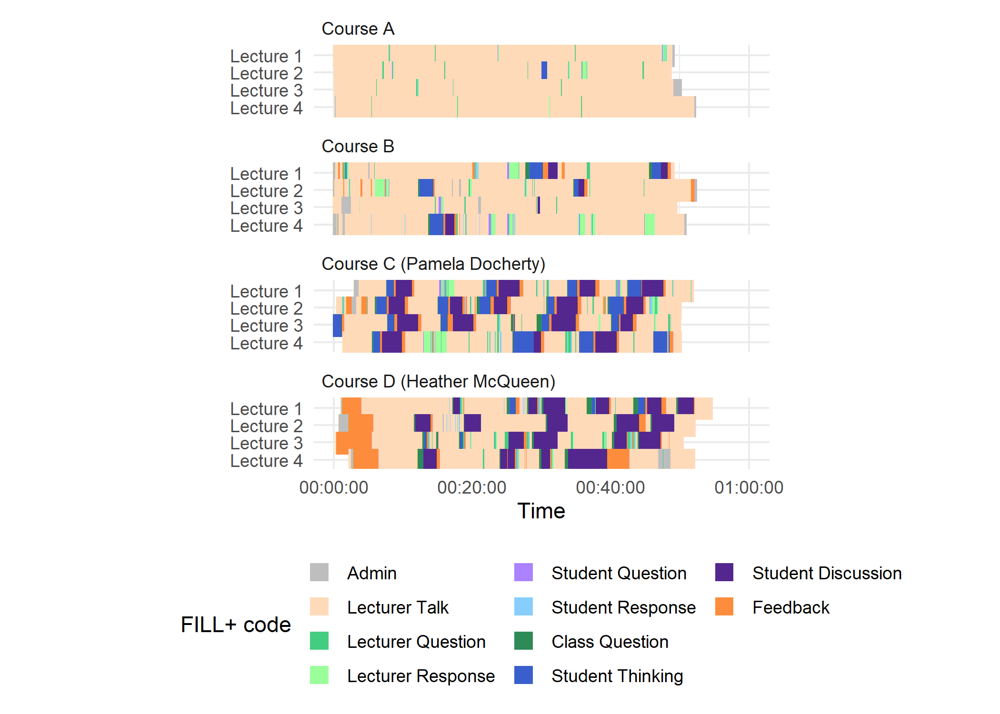
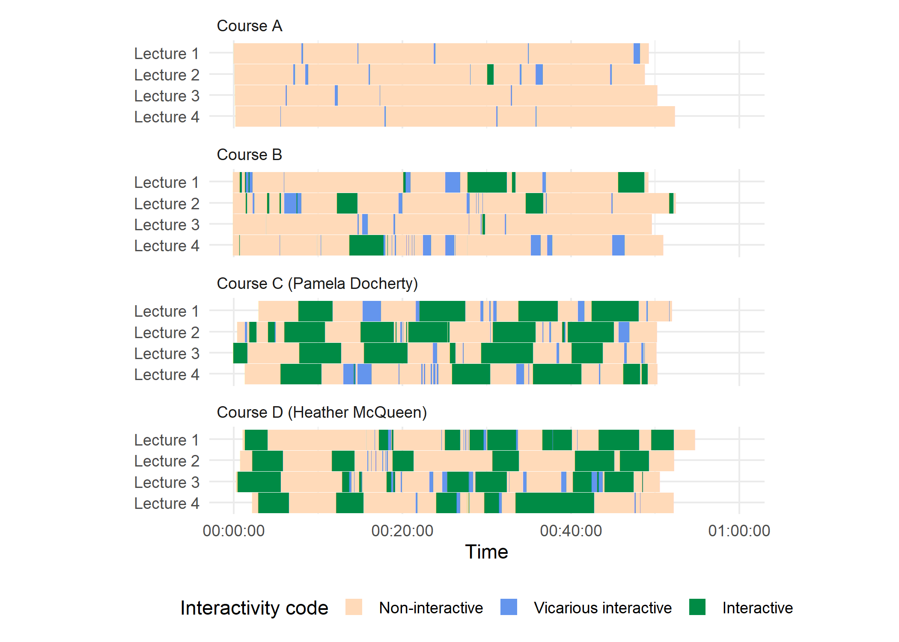
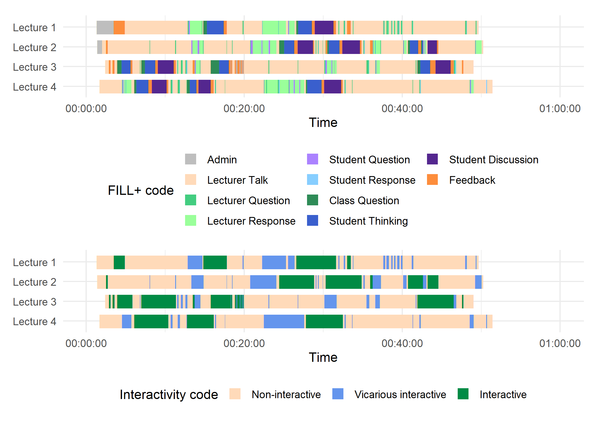
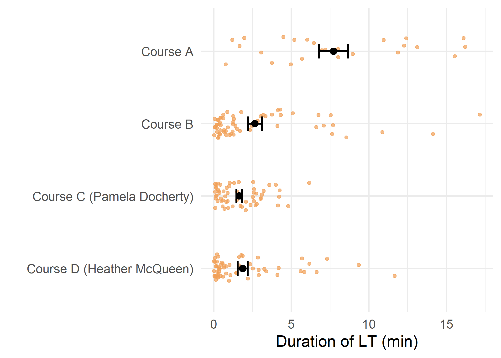

FILL+ timelines
================
George Kinnear
2022-08-15

This script shows an example of loading spreadsheets that contain FILL+
coding data, then plotting the corresponding timelines.

# Data input

## File names

This script looks in the `data` folder for for `.csv` files that have a
particular naming convention:

    [:alnum:]]+_L[[:digit:]]+-[[:digit:]_]+-[[:alnum:]]+\\.csv

In simpler terms, there are three parts to the name, separated from each
other by `-`:

1.  An identifier for the course and lecturer combination,
    e.g. `ILA_L1`. (These are in the form of a string of letters for the
    course, followed by an underscore, followed by `L` and a number
    identifying the lecturer).

2.  The lecture date in `yyyy_mm_dd` form.

3.  The name (or other identifier) of the coder who entered the data.

``` r
file_path = "data/"
csv_file_names = list.files(
  path = file_path,
  pattern = "[[:alnum:]]+_L[[:digit:]]+-[[:digit:]_]+-[[:alnum:]]+\\.csv"
)
```

## File contents

The contents of each `.csv` file should be FILL+ data, where the columns
are:

-   `time` = a timestamp in `hh:mm:ss` format
-   `code` = one of the two-letter FILL+ codes

The rows of data indicate the times when a new FILL+ code begins.

These are the FILL+ codes, along with the colours assigned to them in
the plots:

``` r
fillplus_names <- c(
  # non-interactive
  "AD" = "Admin",
  "LT" = "Lecturer Talk",
  
  # vicarious interactive
  "LQ" = "Lecturer Question",
  "LR" = "Lecturer Response",
  "SQ" = "Student Question",
  "SR" = "Student Response",
  
  # interactive
  "CQ" = "Class Question",
  "ST" = "Student Thinking",
  "SD" = "Student Discussion",
  "FB" = "Feedback"
)
fillplus <- c(
  # non-interactive
  "AD" = "grey",
  "LT" = "peachpuff",
  "NA" = "white",
  
  # vicarious interactive
  "LQ" = "seagreen3", # mid green
  "LR" = "palegreen1", # pale green
  "SQ" = "mediumpurple1", # pale purple
  "SR" = "skyblue1", # pale blue
  
  # interactive
  "CQ" = "seagreen4", # dark green
  "ST" = "royalblue3", # mid blue / teal
  "SD" = "#54278f", # dark purple
  "FB" = "#fd8d3c" # orange
)
```

## Reading the data

The following code reads in all the data, and processes it ready for
plotting.

``` r
raw_codes = csv_file_names %>%
  purrr::map(function(file_name){ # iterate through each file name
    df = fread(
      paste0(file_path, file_name),
      select = c(1:2),
      header = TRUE,
      blank.lines.skip = TRUE,
      col.names = c("start", "code")
    ) %>% 
    mutate(
      time = as.integer(seconds(hms(start))),
      code = str_trim(`code`) # str_trim removes whitespace, e.g. "LT "->"LT"
    ) %>% 
    select(time,code) %>% 
    drop_na(time) # to get rid of empty rows from the CSV
    return(df)
  })

names(raw_codes) = csv_file_names %>% str_replace(., ".csv", "")

all_codings = data.frame(names = names(raw_codes)) %>%
  separate(
    names, into = c("course_lecturer", "date", "coder"), sep = "-", remove = FALSE
  ) %>% 
  mutate(
    coding = raw_codes[names]
  ) %>% 
  select(course_lecturer, date, coding)

# Adjust the formatting of names and dates
all_codings <- all_codings %>% 
  mutate(
    course_lecturer = case_when(
      course_lecturer == "NOD_L1" ~ "Course A",
      course_lecturer == "TPh_L1" ~ "Course B",
      course_lecturer == "PFM_L1" ~ "Vicarious Example",
      course_lecturer == "ILA_L1" ~ "Course C (Pamela Docherty)",
      course_lecturer == "GGA2_L1" ~ "Course D (Heather McQueen)",
      TRUE ~ course_lecturer
    )
  ) %>% 
  separate(date, into = c("date_y", "date_m", "date_d"), sep = "_", remove = FALSE) %>% 
  mutate(date = str_glue("{date_y}-{date_m}-{date_d}")) %>% 
  arrange(course_lecturer, date) %>% 
  group_by(course_lecturer) %>% 
  mutate(date = str_glue("Lecture {row_number()}"))
```

``` r
melted = all_codings %>% 
  unnest(coding) 

full_table = all_codings %>% 
  unnest(coding) %>% 
  group_by(date, course_lecturer) %>% 
  summarise(time = list(0:max(time)), .groups = "drop") %>% 
  unnest(time) %>% 
  left_join(melted, by = c("date", "course_lecturer", "time")) %>% 
  group_by(date) %>%
  fill(-c(date, time)) %>%
  ungroup()

# replace END with NA 
full_table$code <- ifelse(full_table$code == "END", NA, full_table$code) 

# trim uncoded times
full_table <- full_table %>% filter(!is.na(code)) 
```

The FILL+ codes are grouped into three levels of interactivity:

``` r
interactivity_levels <- c(
  "NON" = "peachpuff",
  "INT" = "springgreen4",
  "VIC" = "cornflowerblue",
  "NA" = "white"
)

codes_with_interactivity = full_table %>%  
  mutate(
    # Define groupings of codes by interactivity level (as in Wood et al.)
    code_grp = as.factor(case_when(
      code %in% c("AD", "LT")             ~ "NON",
      code %in% c("LQ", "SR", "SQ", "LR") ~ "VIC",
      code %in% c("CQ", "ST", "SD", "FB") ~ "INT",
      TRUE                                ~ "NA"
    )))
```

# Plotting timelines

## Full FILL+ detail

``` r
allcodes = c("AD","LT","LQ","LR","SQ","SR","CQ","ST","SD","FB")
intcodes = c("NON","VIC","INT")

full_table %>%
  filter(course_lecturer != "Vicarious Example") %>% 
  ggplot(aes(time, date, colour = code)) + 
  geom_point(shape = 124, size = 4) +
  
  # manually specifying colours, ordering the factors appropriately and ensuring that all appear in the legend even if they are not used
  scale_colour_manual("FILL+ code", 
                      values = fillplus,
                      labels = fillplus_names,
                      limits = allcodes,
                      drop = FALSE) + 
  guides(colour = guide_legend(nrow = 4, byrow = FALSE,
                               override.aes = list(shape = 15, size = 4))) + 
  theme_minimal() + 
  theme(axis.line = element_line(colour = "white")) +
  
  # displaying time as HH:MM:SS and specifying limits
  scale_x_time(limits = hms(c("00::00:00","01:00:00"))) +
  scale_y_discrete(limits=rev) +
  
  labs(x = "Time", y = NULL) + 
  coord_fixed(ratio = 150) + theme(legend.position = "bottom") +
  
  facet_wrap(~ course_lecturer, ncol = 1) +
  theme(legend.spacing.y = unit(0, "mm"),
        strip.text = element_text(hjust = 0)
        )
```

<!-- -->

``` r
ggsave("FIG_timelines.pdf", width = 16, height = 16, units = "cm")
```

## Interactivity levels

``` r
codes_with_interactivity %>%
  filter(course_lecturer != "Vicarious Example") %>% 
  ggplot(aes(time, date, colour = code_grp)) + 
  geom_point(shape = 124, size = 4) +
  
  # manually specifying colours, ordering the factors appropriately and ensuring that all appear in the legend even if they are not used
  scale_colour_manual("Interactivity code", 
                      values = interactivity_levels,
                      labels = c("NON" = "Non-interactive",
                                 "VIC" = "Vicarious interactive",
                                 "INT" = "Interactive"),
                      breaks = intcodes,
                      drop = FALSE) + 
  guides(colour = guide_legend(override.aes = list(shape = 15, size = 4))) + 
  theme_minimal() + 
  theme(axis.line = element_line(colour = "white")) +
  
  # displaying time as HH:MM:SS and specifying limits
  scale_x_time(limits = hms(c("00:00:00","01:00:00"))) +
  scale_y_discrete(limits=rev) +
  
  labs(x = "Time", y = NULL) + 
  coord_fixed(ratio = 150) + theme(legend.position = "bottom") +
  
  facet_wrap(~ course_lecturer, ncol = 1) +
  theme(legend.spacing.y = unit(0, "mm"),
        strip.text = element_text(hjust = 0)
        )
```

<!-- -->

``` r
ggsave("FIG_interactivity.pdf", width = 15, units = "cm")
```

    ## Saving 15 x 12.7 cm image

Here is a figure highlighting the comparison between the two levels of
detail:

``` r
full_timeline_C <- full_table %>%
  filter(course_lecturer == "Vicarious Example") %>% 
  ggplot(aes(time, date, colour = code)) + 
  geom_point(shape = 124, size = 4) +
  
  # manually specifying colours, ordering the factors appropriately and ensuring that all appear in the legend even if they are not used
  scale_colour_manual("FILL+ code", 
                      values = fillplus,
                      labels = fillplus_names,
                      limits = allcodes,
                      drop = FALSE) + 
  guides(colour = guide_legend(nrow = 4, byrow = FALSE,
                               override.aes = list(shape = 15, size = 4))) + 
  theme_minimal() + 
  theme(axis.line = element_line(colour = "white")) +
  
  # displaying time as HH:MM:SS and specifying limits
  scale_x_time(limits = hms(c("00::00:00","01:00:00"))) +
  scale_y_discrete(limits=rev) +
  
  labs(x = "Time", y = NULL) + 
  coord_fixed(ratio = 150) + theme(legend.position = "bottom") +

  theme(legend.spacing.y = unit(0, "mm"))

interactivity_timeline_C <- codes_with_interactivity %>%
  filter(course_lecturer == "Vicarious Example") %>% 
  ggplot(aes(time, date, colour = code_grp)) + 
  geom_point(shape = 124, size = 4) +
  
  # manually specifying colours, ordering the factors appropriately and ensuring that all appear in the legend even if they are not used
  scale_colour_manual("Interactivity code", 
                      values = interactivity_levels,
                      labels = c("NON" = "Non-interactive",
                                 "VIC" = "Vicarious interactive",
                                 "INT" = "Interactive"),
                      breaks = intcodes,
                      drop = FALSE) + 
  guides(colour = guide_legend(override.aes = list(shape = 15, size = 4))) + 
  theme_minimal() + 
  theme(axis.line = element_line(colour = "white")) +
  
  # displaying time as HH:MM:SS and specifying limits
  scale_x_time(limits = hms(c("00:00:00","01:00:00"))) +
  scale_y_discrete(limits=rev) +
  
  labs(x = "Time", y = NULL) + 
  coord_fixed(ratio = 150) + theme(legend.position = "bottom")

library(patchwork)
full_timeline_C / interactivity_timeline_C
```

<!-- -->

``` r
ggsave("FIG_interactivity-comparison.pdf", width = 15, units = "cm")
```

    ## Saving 15 x 12.7 cm image

# Duration of LT

There are many other ways to analyse FILL+ data beyond just the
timelines. Here is an example showing the duration of each period of LT,
together with the mean duration per course:

``` r
codes_with_durations <- all_codings %>%
  mutate(
    codes_with_duration = purrr::map(coding,
                                     function(df) {
                                       df %>% mutate(duration = lead(time, 1) - time)
                                     })
  )
codes_with_durations %>% 
  unnest(codes_with_duration) %>% 
  filter(str_detect(course_lecturer, "^Course")) %>% 
  filter(!is.na(code), !code == "END") %>% # remove these non-interesting codes
  filter(code == "LT") %>% 
  group_by(course_lecturer) %>% 
  mutate(
    duration_LT = case_when(code == "LT" ~ duration),
    longest_LT = max(duration_LT, na.rm = TRUE),
    mean_LT = mean(duration_LT, na.rm = TRUE),
    se_LT = sd(duration_LT, na.rm = TRUE) / sqrt(n())
  ) %>% 
  ungroup() %>% 
  ggplot(aes(x = course_lecturer, y = duration/60)) +
  geom_point(
    colour = "#f19f56", # darker version of fillplus["LT"],
    alpha = 0.7,
    position = position_jitter(seed = 123, width = 0.2)
  ) +
  geom_errorbar(aes(ymin=(mean_LT-se_LT)/60, ymax=(mean_LT+se_LT)/60), width=.2, colour = "black", size = 1) +
  geom_point(aes(x = course_lecturer, y = mean_LT/60), colour = "black", size = 3) +
  theme_minimal(base_size = 16) +
  theme(strip.text.y = element_text(angle = 0),
        legend.position = "none",
        panel.grid.minor.y=element_blank(),) +
  scale_x_discrete(limits=rev) +
  coord_flip() +
  labs(#x = "Course/lecturer combination",
       x = "",
       y = "Duration of LT (min)")
```

<!-- -->

``` r
ggsave("FIG_LT_distribution.pdf", width=20, height = 10, units="cm")
```
